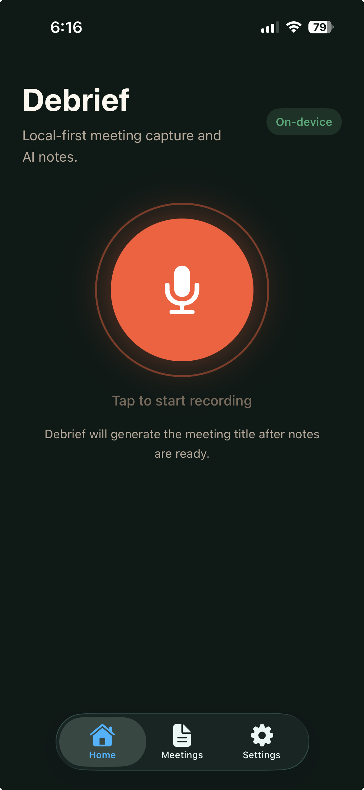
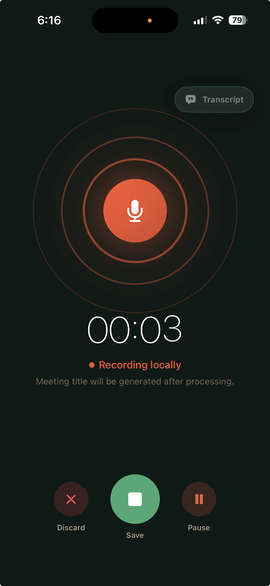
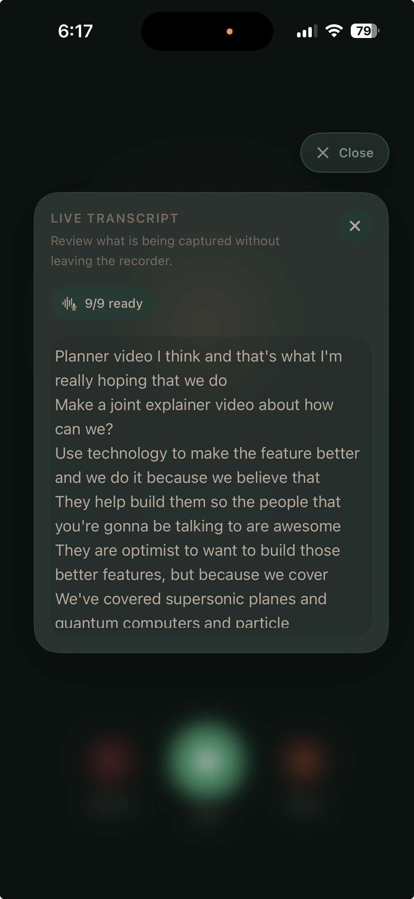
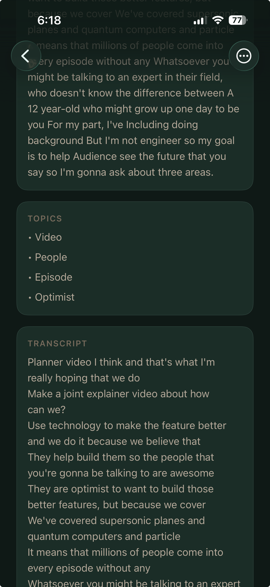
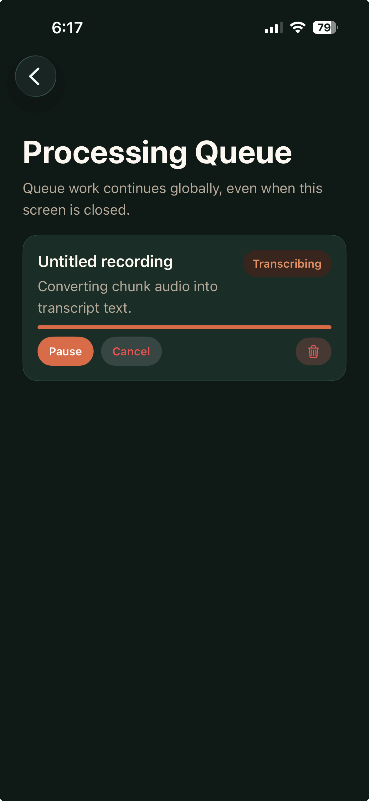
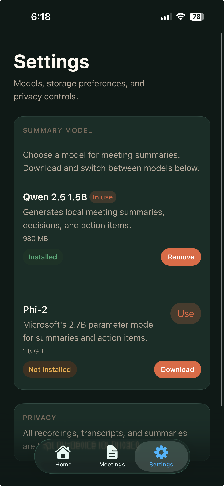

# Debrief

iOS app that records meetings, transcribes audio, and generates structured AI notes — powered by local LLMs running entirely on your device. Runs **Qwen 2.5 1.5B** and **Phi-2** on-device via GGUF inference. No cloud, no accounts, no data leaves the phone.

## Screenshots

<p align="center">
  
  
  
</p>
<p align="center">
  
  
  
</p>

## Features

### Recording
Tap to start a recording from the Home screen. The recorder shows a live amplitude visualizer and elapsed timer. Pause and resume at any point, or discard the session entirely. Meetings are auto-titled by the AI after processing.

### Live Transcript
During recording, open the transcript overlay to see speech-to-text updating in real time. Transcription runs on-device via Apple's `SFSpeechRecognizer`.

### Processing Queue
After saving a recording it enters the queue. The queue runs transcription then LLM summarization in sequence, in the background, even when the screen is closed. Progress is visible per item with retry and cancel controls.

### Meetings
A searchable, sortable list of all completed meetings. Supports filtering by keyword across titles, topics, and summaries.

### Meeting Detail
Each meeting shows:
- AI-generated title and summary
- Action items (with assignees where detected)
- Key decisions
- Open questions
- Topics covered
- Full transcript
- Audio playback of the original recording

From the menu you can copy the transcript, copy the full note as plain text, re-run summarization, or delete the meeting.

### Settings
Download and manage local GGUF summarization models:

| Model | Size | Notes |
|-------|------|-------|
| Qwen 2.5 1.5B Instruct | 980 MB | Default, faster |
| Phi-2 | 1.8 GB | Microsoft 2.7B parameter model |

Models are downloaded once and stored on-device. You can switch the active model or remove installed models at any time.

## Stack

- Swift + SwiftUI (iOS 17+)
- `SFSpeechRecognizer` — on-device speech recognition (Apple Speech framework)
- [`llama.swift`](https://github.com/mattt/llama.swift) — on-device GGUF model inference
- `AVAudioEngine` — microphone capture and chunk rotation

## Architecture

Feature-first MVVM with a strict four-layer hierarchy:

```
SwiftUI View → ViewModel → AppStore → Services
```

- **View** — layout and bindings only, no business logic
- **ViewModel** — UI-ready `@Published` state and named action methods per screen
- **AppStore** — single source of truth, owns the recording lifecycle and queue
- **Services** — pure and injectable, no knowledge of AppStore or ViewModels

All processing (transcription, LLM inference, file I/O) runs off the main thread. No data ever leaves the device.

## Build

```bash
# Build for simulator
xcodebuild build \
  -project Debrief.xcodeproj \
  -scheme Debrief \
  -destination 'platform=iOS Simulator,name=iPhone 16'

# Run tests
xcodebuild test \
  -project Debrief.xcodeproj \
  -scheme Debrief \
  -destination 'platform=iOS Simulator,name=iPhone 16' \
  -only-testing:DebriefTests

# Build and run on simulator or device
./run-ios.sh sim
./run-ios.sh device
```

## CI

- **Tests** — `.github/workflows/ios-tests.yml` runs on every push to `main` and on all pull requests
