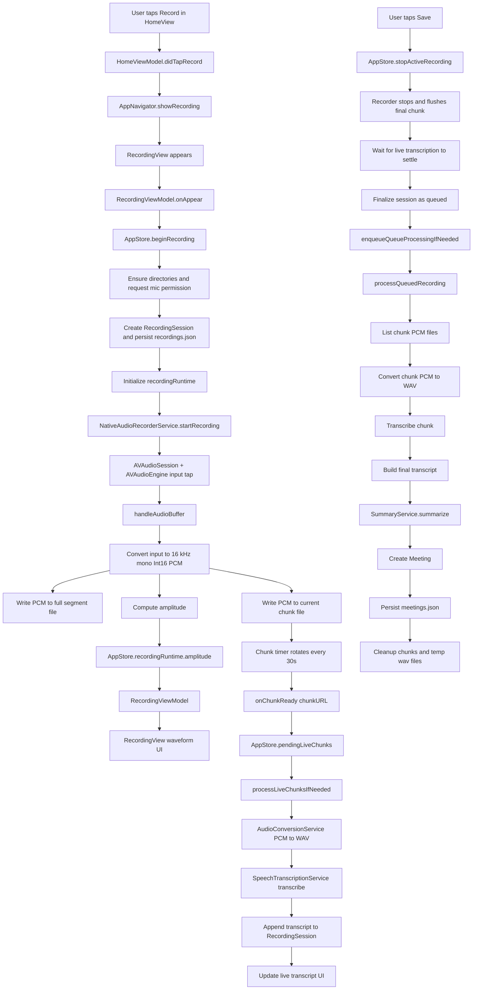

# Recording Architecture

This document explains how recording works in Debrief, how audio moves through the app, and where each responsibility lives.

## Goal

The recording pipeline is designed to:

- capture microphone audio locally
- write a full raw recording to disk
- split the recording into 30 second chunks
- show live amplitude and a live transcript while recording
- finalize the recording into a queue item
- transcribe and summarize the finished recording into a `Meeting`

## Main Files

### Entry and navigation

- `Debrief/Features/Home/Views/HomeView.swift`
- `Debrief/Features/Home/ViewModel/HomeViewModel.swift`
- `Debrief/App/Navigation/AppShellView.swift`

### Recording feature

- `Debrief/Features/Recording/Views/RecordingView.swift`
- `Debrief/Features/Recording/ViewModel/RecordingViewModel.swift`
- `Debrief/Features/Recording/Components/RecordingComponents.swift`

### Core services

- `Debrief/Shared/Services/AppStore.swift`
- `Debrief/Shared/Services/NativeAudioRecorderService.swift`
- `Debrief/Shared/Services/AudioConversionService.swift`
- `Debrief/Shared/Services/SpeechTranscriptionService.swift`
- `Debrief/Shared/Services/SummaryService.swift`
- `Debrief/Shared/Services/DebriefPaths.swift`

### Models and state

- `Debrief/Shared/Domain/AppModels.swift`

## Architecture Layers

### 1. UI layer

`HomeView` starts the recording flow. `RecordingView` renders recording state, amplitude, timer, transcript, and controls.

The view layer does not talk directly to AVFoundation or the speech APIs.

### 2. ViewModel layer

`RecordingViewModel` is the screen state owner for the recording screen. It:

- starts recording on first appearance
- forwards pause, resume, stop, and discard actions
- mirrors `AppStore.recordingRuntime` into UI-friendly published properties

### 3. Store and orchestration layer

`AppStore` owns the app-wide recording lifecycle. It:

- creates `RecordingSession`
- starts and stops the recorder
- receives amplitude and chunk callbacks
- manages live transcription
- finalizes recordings
- runs background queue processing
- persists `recordings.json` and `meetings.json`

### 4. Service layer

`NativeAudioRecorderService` handles low-level microphone capture and chunk writing.

`AudioConversionService` converts raw PCM files into WAV files by prepending a WAV header.

`SpeechTranscriptionService` sends WAV files to Apple's on-device speech recognizer.

`SummaryService` turns the final transcript into structured notes.

## End-to-End Flow

## 1. User starts recording

Flow:

1. User taps the record button in `HomeView`.
2. `HomeViewModel.didTapRecord()` calls `onStartRecording(nil)`.
3. `AppNavigator.showRecording(topic:)` pushes `RecordingView`.
4. `RecordingViewModel.onAppear()` calls `AppStore.beginRecording(topic:)`.

At this point, no audio has been captured yet. The store first prepares state and storage.

## 2. AppStore prepares recording state

`AppStore.beginRecording(topic:)` does the following:

1. Ensures the app directories exist through `DebriefPaths`.
2. Requests microphone permission from `NativeAudioRecorderService`.
3. Creates a `recordingID` based on the current timestamp.
4. Builds:
   - a segment output path for the full PCM file
   - a chunk directory for rotating 30 second chunk files
5. Creates a `RecordingSession` and inserts it into `recordings`.
6. Persists the updated recordings list to `state/recordings.json`.
7. Initializes `recordingRuntime` with stage `.recording`.
8. Starts `NativeAudioRecorderService`.
9. Starts a one-second timer that increments `recordingRuntime.durationSeconds`.

## 3. Native recorder captures microphone audio

`NativeAudioRecorderService` configures `AVAudioSession` and `AVAudioEngine`.

Important configuration:

- audio category: `.record`
- preferred sample rate: `16_000`
- channels: `1`
- tap buffer size: `1024`

The service installs a tap on the input node. Each incoming audio buffer goes through `handleAudioBuffer(_:)`.

That method does this on the hot path:

1. Converts the input buffer into the target format.
2. Downsamples to 16 kHz mono float audio.
3. Converts float samples into signed 16-bit PCM.
4. Calculates a max amplitude value for the UI.
5. Writes the PCM bytes to:
   - the full segment file
   - the current chunk file
6. Throttles amplitude updates before sending them back to the main thread.

This means the app always writes the same captured audio into two destinations:

- one complete recording file for the whole session
- one short-lived rolling chunk file for incremental transcription

## 4. Chunk rotation

The recorder starts a `DispatchSourceTimer` that rotates chunk files every 30 seconds.

When a chunk rotates:

1. the previous chunk file handle is closed
2. if the chunk contains audio, `onChunkReady(chunkURL)` is fired
3. if the chunk is empty, it is deleted
4. a new chunk file is opened

When the user stops recording, the final partial chunk is also flushed through the same callback path.

## 5. Live UI updates while recording

`AppStore.bindRecorderCallbacks()` connects recorder callbacks to app state.

### Amplitude path

1. Recorder computes amplitude in `handleAudioBuffer(_:)`.
2. `onAmplitude` sends the value to `AppStore`.
3. `AppStore` updates `recordingRuntime.amplitude`.
4. `RecordingViewModel` observes `store.$recordingRuntime`.
5. `RecordingView` redraws the waveform UI.

### Timer path

1. `AppStore` runs a repeating `Timer`.
2. Every second it increments `recordingRuntime.durationSeconds`.
3. `RecordingViewModel.elapsedSeconds` updates.
4. `RecordingView` redraws the timer text.

### Status path

The UI also reflects:

- `recordingRuntime.stage`
- `recordingRuntime.liveStatus`
- `recordingRuntime.chunksReceived`
- `recordingRuntime.chunksTranscribed`
- `recordingRuntime.errorMessage`

## 6. Live transcription while recording

When a chunk is ready, `AppStore` appends the chunk URL to `pendingLiveChunks` and starts live processing if it is not already running.

`processLiveChunksIfNeeded()` guarantees that only one live transcription task runs at a time.

For each chunk:

1. `AudioConversionService.convertPCMToWAV(...)` creates a temporary WAV file.
2. `SpeechTranscriptionService.transcribe(audioURL:)` sends the WAV file to `SFSpeechRecognizer`.
3. The recognized text is appended to `RecordingSession.transcript`.
4. `recordingRuntime.liveTranscript` is updated from the stored session.
5. `recordingRuntime.chunksTranscribed` increments.
6. The temporary WAV file is deleted.

Important note:

- live transcription uses Apple's `Speech` framework
- it requires on-device recognition
- the currently selected Whisper model is not used by `SpeechTranscriptionService`

## 7. Pause, resume, interruptions, and termination

### Manual pause

When the user taps pause:

1. `RecordingViewModel.didTapPauseResume()` calls `AppStore.pauseActiveRecording()`
2. `NativeAudioRecorderService.pauseRecording()` removes the tap, stops the engine, stops chunking, and deactivates the audio session
3. `recordingRuntime.stage` becomes `.paused`

### Manual resume

When the user taps resume:

1. `AppStore.resumeActiveRecording()` calls `NativeAudioRecorderService.resumeRecording()`
2. the recorder reconfigures the audio session
3. the tap is reinstalled
4. the engine restarts
5. once audio buffers start arriving again, chunking resumes
6. `recordingRuntime.stage` becomes `.recording`

### Audio interruptions

The recorder listens for `AVAudioSession.interruptionNotification`.

When an interruption begins (e.g. incoming phone call):

- recording is paused internally
- chunking is stopped
- the UI stage becomes `.paused`
- user sees notification: "Recording paused due to interruption"

When the interruption ends:

- recording auto-resumes
- user sees notification: "Recording resumed" (briefly, then clears)
- if auto-resume fails (e.g. session setup error), the UI shows manual resume required

### App termination

On app termination:

- the recorder flushes and closes file handles
- the store finalizes the active recording as queued

## 8. Stop and finalize

When the user taps save:

1. `RecordingViewModel.didTapStop()` calls `AppStore.stopActiveRecording()`
2. the recorder stops
3. the duration timer stops
4. the store waits until:
   - the current live transcription task finishes
   - `pendingLiveChunks` is empty
5. `finalizeActiveRecording(queueState: .queued)` marks the recording complete
6. `enqueueQueueProcessingIfNeeded()` starts post-recording processing

Finalizing updates the `RecordingSession` with:

- `durationSeconds`
- `isRecordingComplete = true`
- `queueState = .queued`
- `isProcessing = false`

Then the store resets `recordingRuntime` back to its idle state.

## 9. Queue processing after recording

The queue pipeline exists so completed recordings can be processed even after the recording screen closes.

`enqueueQueueProcessingIfNeeded()` starts one background queue task that processes queued recordings serially.

For each queued recording, `processQueuedRecording(recordingID:)` does this:

1. marks the recording as processing
2. loads all `.pcm` chunk files from disk
3. starts from the last unprocessed chunk timestamp
4. for each remaining chunk:
   - convert PCM to WAV
   - transcribe with `SpeechTranscriptionService`
   - append text to the session transcript
   - persist updated recordings state
5. switches queue phase to summarizing
6. calls `SummaryService.summarize(...)`
7. creates a `Meeting`
8. persists the meeting to `state/meetings.json`
9. links the `RecordingSession` to the new `meetingID`
10. removes temporary chunk and wav directories

If processing fails:

- the recording is marked with `queueState = .failed`
- the error is stored in `processingError`

## Data Flow Diagram



## Runtime State Model

There are two different kinds of recording state:

### Persisted recording state

`RecordingSession` is durable state saved to disk. It includes:

- identity and timestamps
- title and participants
- duration
- transcript
- queue state
- processing error
- relative audio path
- linked meeting ID

This is the source of truth for recordings after the recording screen is gone.

### In-memory runtime state

`RecordingRuntimeState` is ephemeral UI state. It includes:

- active `recordingID`
- current stage
- timer value
- amplitude
- live transcript
- live transcription status
- chunk counters
- current error message

This is reset after finalization or discard.

## Storage Layout

The app stores recording artifacts under the Documents directory:

```text
Documents/
├── debrief/
│   ├── recordings/
│   │   └── {recordingID}/
│   │       ├── segments/
│   │       │   └── {segmentID}.pcm
│   │       ├── chunks/
│   │       │   └── {segmentID}/
│   │       │       └── {timestamp}.pcm
│   │       └── tmp/
│   │           ├── live-wav/
│   │           └── wav/
│   ├── playback/
│   └── state/
│       ├── recordings.json
│       └── meetings.json
└── models/
```

### What each folder is for

- `segments/`: the full raw PCM recording kept for playback and later access
- `chunks/`: rolling chunk PCM files used for live and queued transcription
- `tmp/live-wav/`: temporary WAVs for live transcription
- `tmp/wav/`: temporary WAVs for queue processing
- `state/recordings.json`: persisted `RecordingSession` array
- `state/meetings.json`: persisted `Meeting` array

## Concurrency Model

The recorder itself uses three internal queues:

- `stateQueue`: thread-safe state flags like recording and pause state
- `audioQueue`: resume coordination
- `fileQueue`: segment and chunk file writes

The app store also uses async tasks for:

- live transcription
- queue processing
- summary generation

Important behavior:

- only one live transcription task runs at a time
- only one queue processing task runs at a time
- queue processing is blocked while an active recording is in progress

## Important Implementation Notes

### 1. The full recording is stored as raw PCM

The segment file is not WAV or m4a. It is raw PCM written directly from the recorder.

That means any consumer that wants standard audio playback or processing must either:

- understand the format already, or
- convert it to WAV first

### 2. Live and queued transcription both use Apple Speech

The selected Whisper model is part of app settings and downloads, but the current recording pipeline transcribes through `SpeechTranscriptionService`, which uses `SFSpeechRecognizer`.

If the team later moves to Whisper-based local transcription, the integration point is primarily:

- `SpeechTranscriptionService`
- queue/live transcription calls in `AppStore`

### 3. Live transcript is incremental but not final truth

During recording, transcript text is appended chunk by chunk.

After recording stops, queue processing may still transcribe remaining chunks and append more text before summarization.

### 4. Empty chunks are removed

Chunk rotation deletes empty chunk files instead of keeping them.

### 5. Queue cleanup removes temporary artifacts

After successful queue processing, the app removes:

- `chunks/`
- `tmp/`

The permanent segment file remains.

## Common Questions

### Where does recording actually begin?

In `RecordingViewModel.onAppear()`, which calls `AppStore.beginRecording(topic:)`.

### Where is microphone audio captured?

In `NativeAudioRecorderService`, using an `AVAudioEngine` input node tap.

### Where is amplitude calculated?

In `NativeAudioRecorderService.handleAudioBuffer(_:)`.

### Where does live transcript text come from?

From chunk files created by the recorder, converted to WAV, then transcribed by `SpeechTranscriptionService`.

### Where is the final transcript stored?

In `RecordingSession.transcript`, persisted into `state/recordings.json`, and later copied into the created `Meeting`.

### What creates the meeting notes?

`SummaryService.summarize(...)` during queue processing.

## Quick Trace for Debugging

If you need to debug a recording issue, follow this path in order:

1. `HomeViewModel.didTapRecord()`
2. `AppNavigator.showRecording(topic:)`
3. `RecordingViewModel.onAppear()`
4. `AppStore.beginRecording(topic:)`
5. `NativeAudioRecorderService.startRecording(...)`
6. `NativeAudioRecorderService.handleAudioBuffer(_:)`
7. `AppStore.bindRecorderCallbacks()`
8. `AppStore.processLiveChunksIfNeeded()`
9. `AppStore.transcribeLiveChunk(_:)`
10. `AppStore.stopActiveRecording()`
11. `AppStore.processQueuedRecording(recordingID:)`

## Summary

The recording architecture is centered around `AppStore` orchestration and `NativeAudioRecorderService` capture.

The high-level flow is:

1. start recording from the UI
2. capture mic audio into a full PCM file and rotating chunk PCM files
3. transcribe chunks incrementally for live feedback
4. stop and finalize the recording
5. queue the completed recording for transcript completion and summarization
6. create a `Meeting` and clean up temporary artifacts
